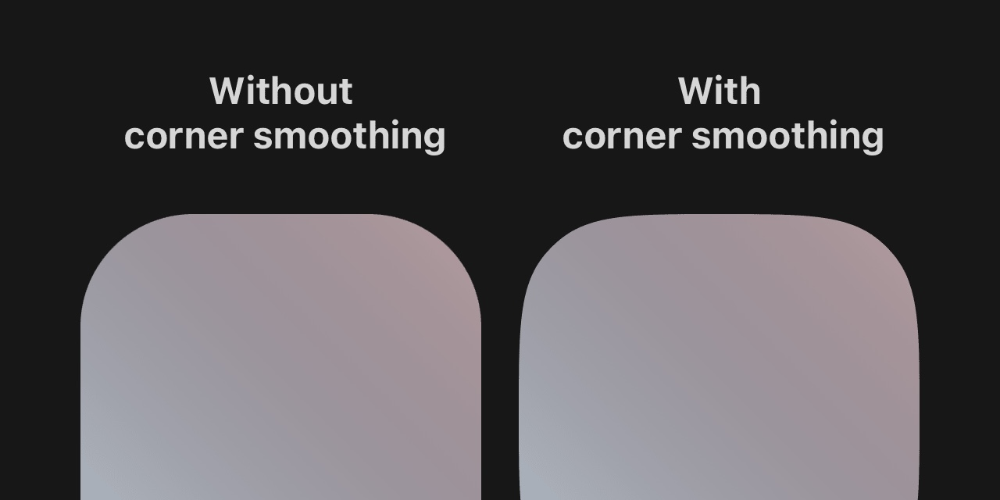

# Superellipse



The Superellipse, famously known as the "squircle," represents a delightful blend of a square and a circle's visual attributes. This geometric shape has been emblematic of the seamless user experience on Apple devices since they [patented](http://assets.sbnation.com/assets/1701443/USD670286S1.pdf) it in 2012. The subtlety of a superellipse, though not immediately conspicuous, demands intricate mathematics to perfect. Inspired by Figma's comprehensive [article](https://www.figma.com/blog/desperately-seeking-squircles/) on the subject, we recognized the gap in readily integrating superellipses into web interfaces.

**Superellipse** is our solution to bringing the refined aesthetic of superellipses to the web, enabling developers to imbue their UIs with the native feel that has been elusive thus far. With just a simple `npm` installation, you can envelop any component in a superellipse, effortlessly elevating the user experience.

## Features

- **Easy Integration**: Wrap any React component within a Superellipse for instant native UI feel.
- **Customizable**: Adjustable corner radius and smoothing to fit your design specifications.
- **Performance Optimized**: Lightweight implementation ensuring minimal impact on load times.

## Getting Started

### Installation

```bash
npm i superellipse
```

### Usage

Here's a quick example to get you started:

```jsx
import React from 'react';
import { Superellipse } from 'superellipse';

const App = () => (
  <Superellipse cornerRadius={8} cornerSmoothing={1}>
    <YourComponent />
  </Superellipse>
);

export default App;
```

### Props

Customize your superellipse by adjusting the following props:

- `cornerRadius`: Defines the radius of the corners.
- `cornerSmoothing`: Adjusts the smoothness of the corners.
- More props documented in our detailed [API Reference](#api-reference).

## API Reference

For a more in-depth look at the available properties and their functionalities, please refer to the [API Reference](docs/api.md).

## Examples

Discover how `superellipse` can be applied in various scenarios through our [Examples](docs/examples.md) documentation.

## Contributing

We welcome contributions! If you're interested in improving `superellipse`, check out our [Contributing Guidelines](CONTRIBUTING.md).

## License

Distributed under the MIT License. See `LICENSE` for more information.

## Acknowledgments

- [Figma's Squircle Article](https://www.figma.com/blog/desperately-seeking-squircles/)
- Apple's Patent on Superellipses
```